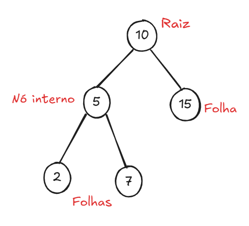

# 01 - Defina o que é raiz, nó interno e folha em uma árvore binária

- **Raiz:** é o **primeiro nó da árvore**, o ponto de partida a partir do qual todos os outros nós são conectados. Uma árvore binária possui **apenas uma raiz**.

- **Nó interno:** é um nó que **possui pelo menos um filho** (esquerda e/ou direita). Ele não é nem a raiz isolada nem uma folha.

- **Folha:** é um nó que **não possui filhos**, ou seja, está no final de um ramo da árvore.

