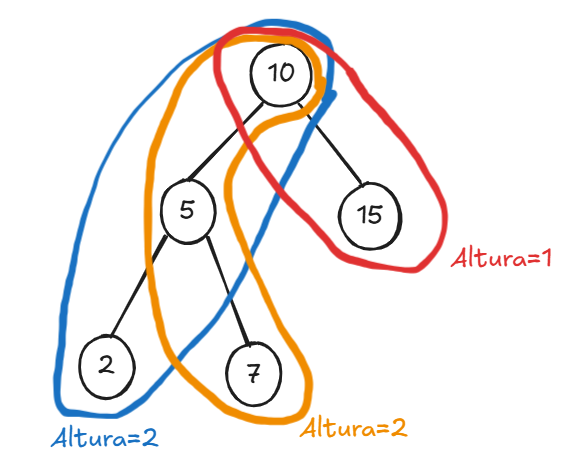

# 03 - Calcule a altura de uma árvore manualmente a partir de um desenho.

Obs: A altura de uma árvore é o número de arestas no caminho mais longo da raiz até uma folha. 
- Cada nível abaixo da raiz aumenta a altura em 1.

